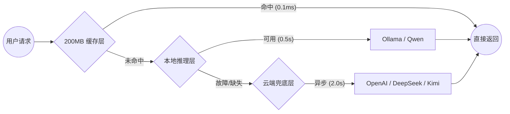

  

# 🌟 YuxTrans

  <strong>精准 · 稳定 · 具有温度的 AI 翻译空间</strong>

  一款专为深阅读设计的浏览器扩展。支持本地模型原生加速、海量物理缓存与“Warm Paper”护眼美学。

  
  
  
  

---

## 💡 为什么选择 YuxTrans?

在信息爆炸的时代，**YuxTrans** 致力于解决翻译过程中的三大痛点：**隐私泄露**、**连接不稳定**与**交互冰冷**。我们通过硬核的技术架构与克制的设计，为您还原纯粹的阅读体验。

---

## 🚀 核心特性矩阵 (Key Features)

| 🏠 本地优先 (Privacy) | 💾 物理定额记忆 (Memory) | 🛡️ 断点免疫 (Robustness) |
| :--- | :--- | :--- |
| 原生支持 **Ollama (Qwen)**，开启离线翻译，让敏感数据永不出户。 | 弃用虚浮计数，建立 **200MB 字节级缓存**。 IndexedDB 秒级唤回已读真意。 | 针对小模型实现的“自愈逻辑”，即便处理 **237/670** 段长文也永不卡死。 |

| 🎨 Warm Paper 审美 | 🤖 深度翻译人格 | ✨ 傻瓜式自动化 |
| :--- | :--- | :--- |
| Isometric 圆角与**柔和米色调**。让工具退后，内容向前，护眼且优雅。 | 预设**日常、学术、技术、文学**人格。精准锁定技术术语，捕捉文学意境。 | GitHub API 实时感应。发现新版自动挂载 **[NEW]** 角标，支持一键更新。 |

---

## 🧠 混合路由架构 (Hybrid Router)

YuxTrans 通过三级缓存与推理引擎，确保翻译请求的绝对稳健与极速响应：

---

## 📦 简易安装指引 (Quick Start)

仅需三步，即可在您的 Chrome/Edge 浏览器中部署此翻译空间：

1.  **获取源码**: 在 [Releases](https://github.com/Yaemikoreal/YuxTrans/releases) 获取最新的 `v0.3.0` 压缩包并解压。
2.  **加载插件**: 
    * 访问 `chrome://extensions/` 并开启 **“开发者模式”**。
    * 点击 **“加载已解压的扩展程序”**，选择项目中的 `extension/` 文件夹。
3.  **点亮翻译**: 点击图标进入设置，在 **“AI 模型服务”** 中连接 Ollama 或填入 API Key 即可。

---

## ⚙️ 深度配置中心 (Providers)

YuxTrans 完美兼容多种 AI 底层，支持自定义 Prompt 以对齐不同场景：

- **本地端**: Ollama (Qwen2.5 / Llama3 / Phi3)
- **云端**: 通义千问 (Qwen)、DeepSeek (深度求索)、OpenAI、Moonshot (Kimi)、Siliconflow、Groq、Anthropic。
- **模式**: 同步/异步翻译、双语对照、沉浸式划词。

---

## 🤝 开发与贡献 (Contributing)

我们欢迎每一位追求“质感”的极客加入：
- 协助我们优化 4B/7B 模型在不同翻译人格下的 **Prompt** 指引。
- 参与 **Warm Paper UI** 的多色彩主题扩展。
- 提交更多语言的 **常用热词缓存库**。

---

## 许可证

基于 [MIT License](LICENSE) 协议发布。

  <strong>YuxTrans —— 让翻译更精准，让阅读更优雅。</strong>

