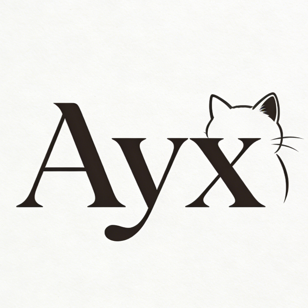
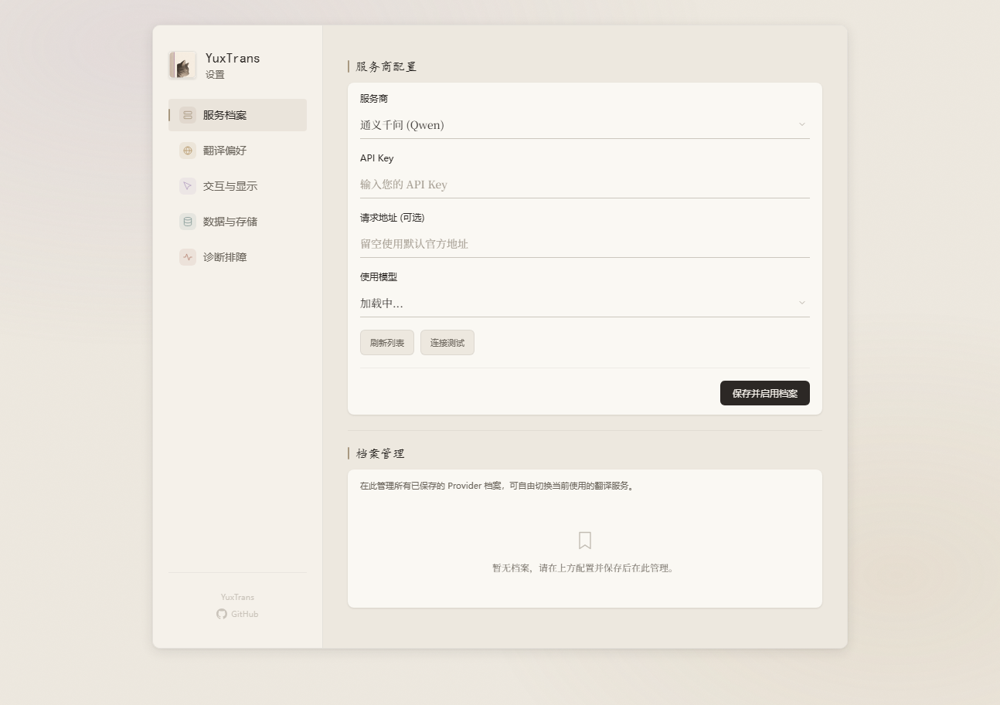
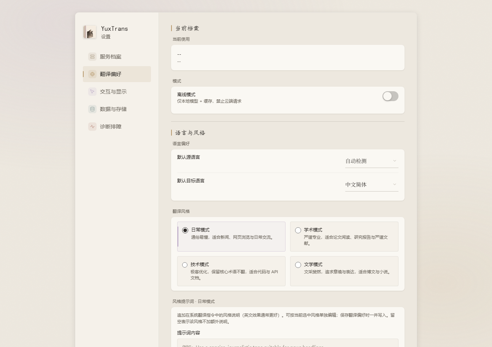
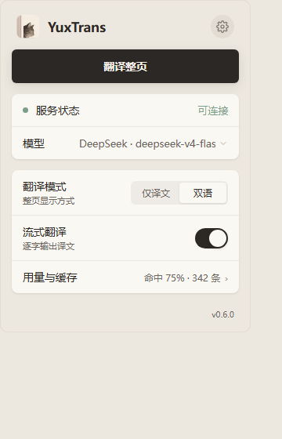
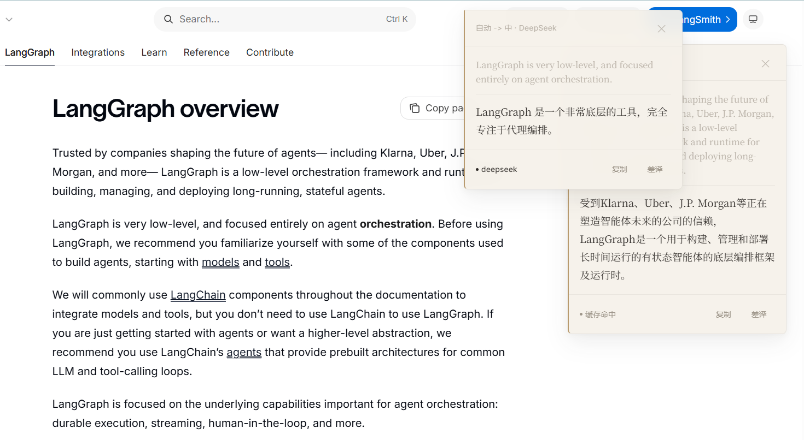
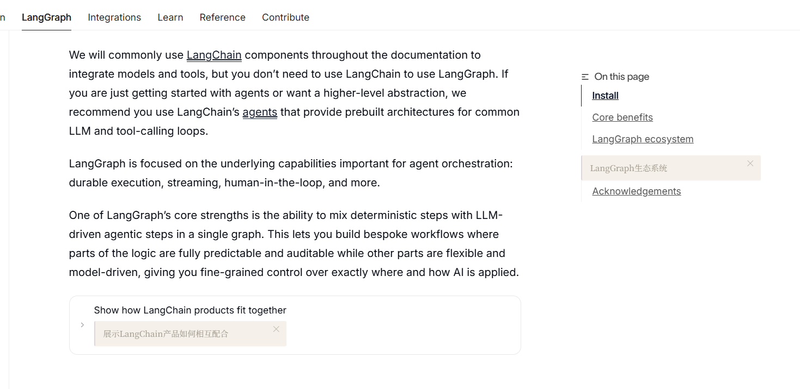
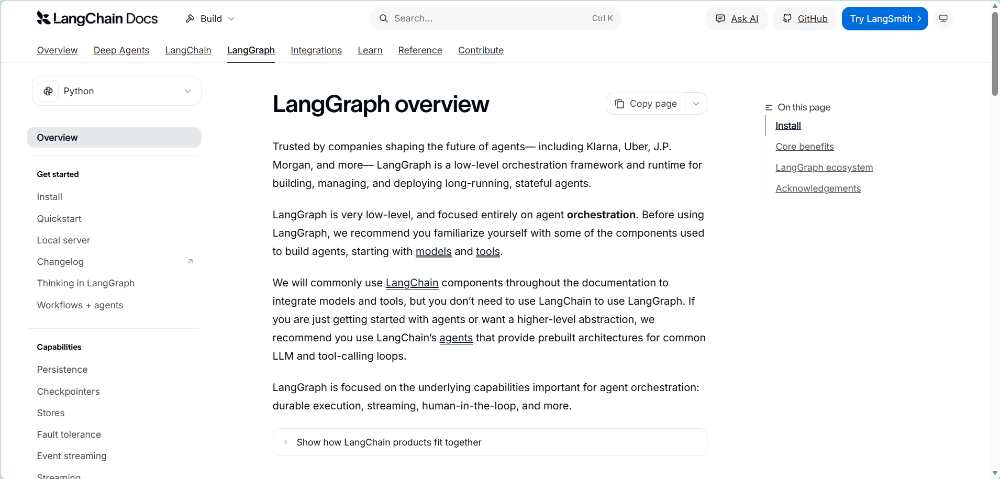
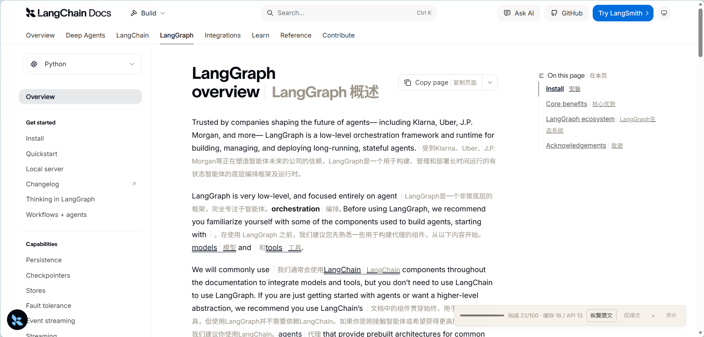
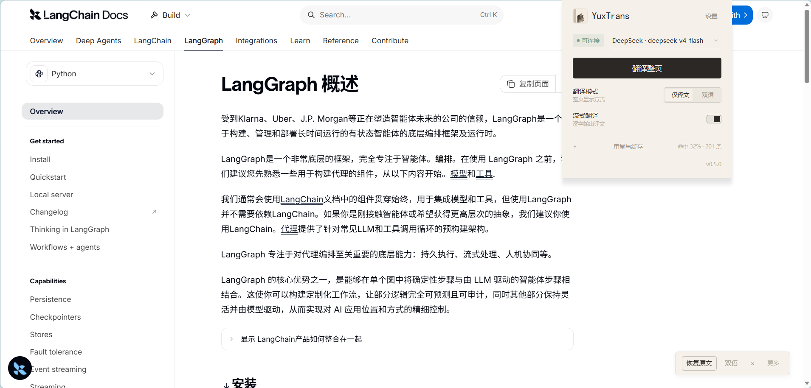

<p align="center">
  <sub><b>简体中文</b> · <a href="README_EN.md">English</a></sub>
</p>

<p align="center">
  
</p>

<h1 align="center">YuxTrans</h1>

<p align="center">
  <em>翻译退至页边，阅读留在正中。</em><br>
  <span>一款面向深阅读的 AI 翻译浏览器扩展</span><br>
  <em>A translation extension for deep reading.</em>
</p>

<p align="center">
  
  
</p>

---

## 关于 YuxTrans

YuxTrans 是一个**纯浏览器扩展**，不依赖任何后端服务。Service Worker 直接连接本地 Ollama 或云端 API，在网页边缘完成翻译，再把结果以页边批注的形式落回原文一侧。

它不为功能密度而生，只回应一个问题：在长篇阅读里，翻译如何尽量不打断思路。围绕这个问题，它只做三件事，并努力把它们做安静——

- **本地优先**：原生支持 Ollama，敏感文本不出本机，离线亦可阅读。
- **稳态可依**：本地模型不可用或云端限流时，自动切换备用供应商；默认 200MB IndexedDB 缓存，命中即毫秒返回。
- **档案式管理**：设置页保存多组「供应商档案」（Provider、凭据、模型），popup 中一键切换。

当前稳定版为 **v0.6.0**。

## 设计取向（UI v2.1）

一句话：**书房衬纸的皮，Apple 的骨。**

- **皮是纸墨**：墨韵为骨，暖纸为底，暮瞳作微光。拒绝纯黑纯白、高饱和科技色与弹跳动效；加载态是未写完的省略号，而非旋转的环。
- **骨是秩序**：借鉴 Apple HIG 的组件骨架——分组卡片即信息层级、「标签左 / 值右」的扫读动线、0.5px 分隔线、一屏唯一实心主动作。Popup 与设置页由此获得清晰的落点，而非一片均匀的灰。
- **为眼睛校准的三级文字**：主文本墨韵（13:1）/ 译文 `#4A453F`（8.6:1，AAA）/ 标签 `#6B655C`（5.1:1，AA），批注灰只留给出占位与装饰。长读不累，层次仍在。
- **长在页面里，又不碰页面**：全部悬浮 UI（划词浮窗、操作条、控制条等）运行在 Shadow DOM 中，样式与宿主页面严格隔离。

## 三种整页双语呈现

深阅读与快速扫读是两种正当的需求，YuxTrans 不做取舍，给三种模式：

- **段落对照**（新增）：译文整段跟随在原文段落之后，原文排版一字不动——连续读完原文，再读译文，视线不跳跃。鼠标悬停译文段，暮瞳微光铺满整段。
- **行内注脚**：译文以暮瞳竖线标注、紧跟句后，适合边读边对照。
- **仅译文**：整页替换为译文，效率优先，可一键恢复原文。

在「设置 → 交互与显示 → 双语呈现方式」中选择，整页控制条上也可随时切换双语 / 仅译文。

---

## 界面预览

以下截图以真实使用路径排列（资源位于 `logo/`）。

### 1. 设置 · 服务档案

macOS 系统设置式骨架：侧栏五个模块（服务档案 · 翻译偏好 · 交互与显示 · 数据与存储 · 诊断排障），各配分区色线性图标；设置项收进分组卡片，标签在左、控件在右。凭据仅存本机浏览器。



### 2. 设置 · 翻译偏好

当前档案一览、离线模式、语言方向，以及日常 / 学术 / 技术 / 文学四种风格；支持按风格编辑「风格提示词」，保存偏好时一并写入。



### 3. Popup 控制面板

工具栏图标点开是一方小册：唯一实心主动作「翻译整页」，分组卡片承载连接状态、档案切换、仅译文 / 双语分段控件、流式开关，以及可折叠的用量与缓存看板。浅色纸张方案。



### 4. 划词翻译

选中页面文本后弹出轻薄浮层：斜体原文与译文上下对照，底部工具条承载钉住 / 插入 / 复制等线性图标操作；可钉住多窗对照，不遮挡阅读节奏。



### 5. 悬停段落翻译（Alt）

按住修饰键（默认 **Alt**，可在设置中改为 Ctrl）并将鼠标悬停在段落上，译文以页边便签形式出现在段落后，可单独关闭，无需划词。



### 6. 整页翻译：原文 → 双语 → 仅译文

**翻译前**，页面为纯英文原文：



**双语模式**（行内注脚），每句原文之后以暮瞳竖线标注译文，保留原排版与节奏；底部控制条记录进度与缓存 / API 命中：



**仅译文模式**，整页替换为译文，可一键恢复原文：



---

## 安装

1. 在 [Releases](https://github.com/Yaemikoreal/YuxTrans/releases) 下载最新 `YuxTrans-extension-v*.zip` 并解压；或克隆本仓库。
2. 打开 Chrome / Edge，访问 `chrome://extensions/` 或 `edge://extensions/`。
3. 开启右上角「开发者模式」。
4. 点击「加载已解压的扩展程序」，选择 **`extension/`** 目录（需含 `manifest.json`）。
5. 工具栏出现图标后即可使用。

---

## 配置

点击扩展图标 →「设置」：

| 模块 | 做什么 |
| :--- | :--- |
| **服务档案** | 选择本地 Ollama / 云端供应商 / 自定义 OpenAI 兼容端点；保存并启用档案。 |
| **翻译偏好** | 语言方向、翻译风格、风格提示词、离线模式。 |
| **交互与显示** | 划词触发方式、流式输出、双语呈现方式（行内注脚 / 段落对照）、悬停/词典、原文样式等。 |
| **数据与存储** | 术语表、缓存限额、导入导出、网站规则。 |
| **诊断排障** | 用量与请求日志（只读）。 |

| 类型 | 操作 |
| :--- | :--- |
| 本地 Ollama | Provider 选 `local`，填写模型名（如 `qwen3.5:0.8b`），确保 Ollama 已启动。 |
| 云端供应商 | 选 `qwen` / `openai` / `deepseek` / `anthropic` / `groq` / `moonshot` / `siliconflow` / `google`（免 Key）等，填写 API Key 与模型。 |
| 自定义供应商 | 选 `custom`，填写端点、API Key、API 格式与模型。 |

各模块底部有独立「保存」按钮，改哪页存哪页。API Key 与配置仅保存在浏览器本地。

---

## 用法

### 划词翻译

- 默认「修饰键 + 划选」：按住 **Ctrl**（可在设置中改为 Alt/Shift）划选文本松开后翻译；若想选中即译，在「交互与显示」中改为「选中后弹出」。
- 快捷键 `Alt + T`（macOS 同 `Alt + T`）。
- 右键选中文本 →「翻译选中内容」。

### 悬停段落翻译

- 在「交互与显示」中开启「悬停段落翻译」。
- 按住 **Alt**（或你设置的修饰键），鼠标悬停在段落上约 300ms，段落后出现译文便签。

### 单词词典

- 开启「单词词典模式」后，划到或双击单词可弹出释义卡片（音标、义项、例句）。

### 整页翻译

- Popup 主按钮「翻译整页」。
- 快捷键 `Alt + P`（macOS 同 `Alt + P`）。
- 页面空白处右键 →「翻译整页」。

可视区域优先、支持流式边译边显与取消；双语呈现可选「行内注脚」或「段落对照」（设置 → 交互与显示），控制条可切换双语 / 仅译文或恢复原文。

### 快捷键

| 快捷键 | 功能 |
| :--- | :--- |
| `Alt + T` | 翻译选中内容 |
| `Alt + P` | 翻译整页 |
| `Ctrl`（可改）+ 划选 | 划词翻译（默认触发模式） |
| `Alt`（可改）+ 悬停 | 段落翻译（需在设置中开启） |

> **提示**：若快捷键不生效（被浏览器或其他扩展占用），可在 `chrome://extensions/shortcuts` 中自定义。

---

## 开发与测试

```bash
# 扩展单元测试（Node 内置 test runner，无额外依赖）
npm test

# ESLint 静态检查
npm run lint

# Playwright 冒烟：真实 Chromium 加载扩展，模拟划词断言浮窗
npm run test:e2e
```

加载方式见上文「安装」；改 `background.js` / `content.js` / `options.js` 后需在扩展管理页重新加载。维护说明见 [AGENTS.md](AGENTS.md)，变更记录见 [CHANGELOG.md](CHANGELOG.md)，视觉规范见 [docs/UI_DESIGN_SYSTEM.md](docs/UI_DESIGN_SYSTEM.md)。

---

## 许可证

基于 [MIT License](LICENSE) 发布。

<p align="center">
  <em>YuxTrans —— 翻译退至页边，阅读留在正中。</em>
</p>
